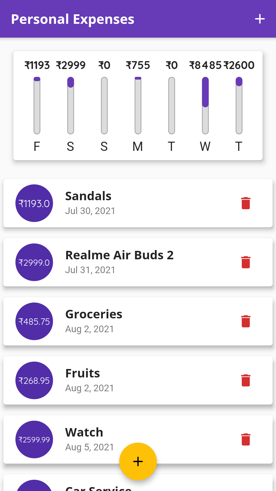
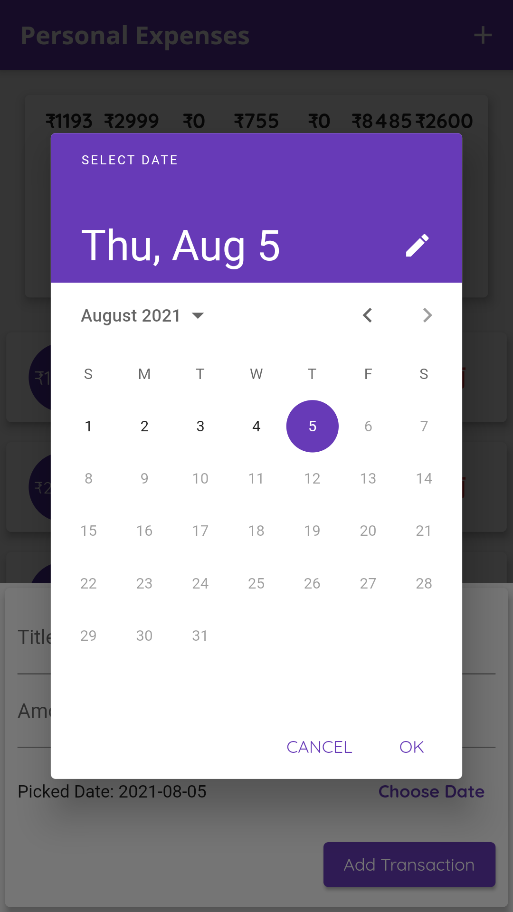
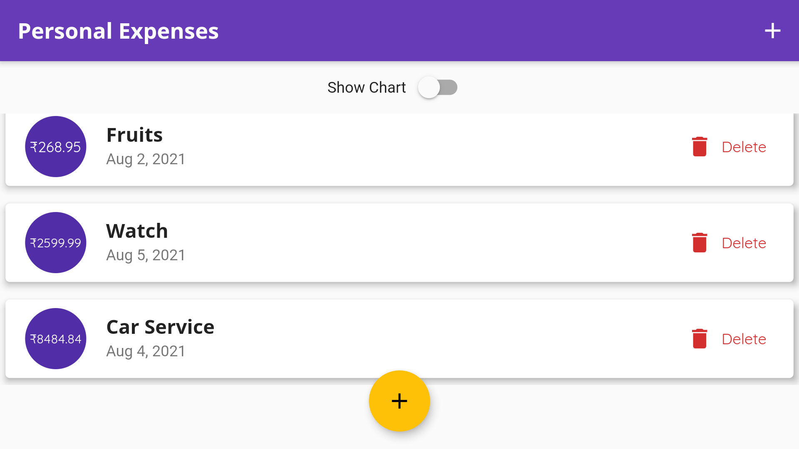
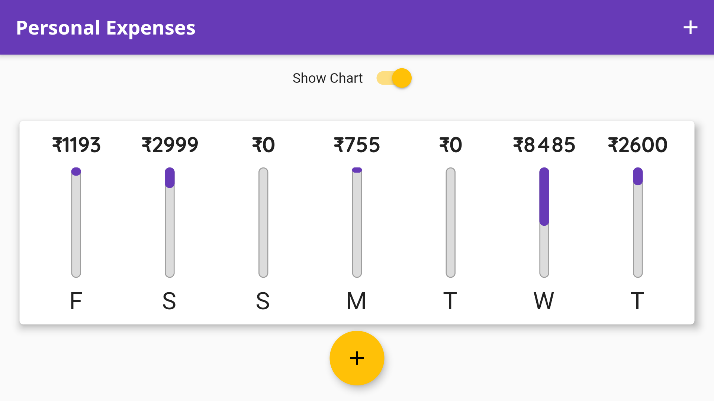

# expense_planner
A new Flutter project.
This app is an entry level cross-platform app developed using flutter.
In this application the user can manage his/her epenses and a chart is displayed for the expenditure done in the past 7 days.

# User Interface
<table>
  <tr>
    <td>HoemPage</td>
    <td>Date Selector</td>
    <td>Landscape Mode</td>
    <td>Landscape mode with Show Chart</td>
  </tr>
  <tr>
    <td>
    <td></td>
    <td></td>
    <td></td>
  </tr>
 </table>
